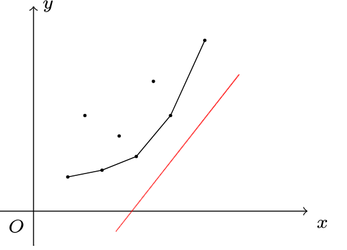
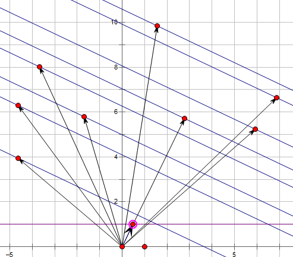

# 斜率优化DP
```admonish question title = "[「HNOI2008」玩具装箱](https://www.luogu.com.cn/problem/P3195)"
有 $n$ 个玩具，第 $i$ 个玩具价值为 $c_i$。要求将这 $n$ 个玩具排成一排，分成若干段。对于一段 $[l,r]$，它的代价为 $(r-l+\sum_{i=l}^r c_i-L)^2$。其中 $L$ 是一个常量，求分段的最小代价。

$1\le n\le 5\times 10^4, 1\le L, c_i\le 10^7$。
```

### 朴素的 DP 做法

令 $f_i$ 表示前 $i$ 个物品，分若干段的最小代价。

状态转移方程：$f_i=\min_{j<i}\{f_j+(i-(j+1)+pre_i-pre_j-L)^2\}=\min_{j<i}\{f_j+(pre_i-pre_j+i-j-1-L)^2\}$。

其中 $pre_i$ 表示前 $i$ 个数的和，即 $\sum_{j=1}^i c_j$。

该做法的时间复杂度为 $O(n^2)$，无法解决本题。

### 优化

考虑简化上面的状态转移方程式：令 $s_i=pre_i+i,L'=L+1$，则 $f_i=\min_{j<i}\{f_j+(s_i-s_j-L')^2\}$。

将与 $j$ 无关的移到外面，我们得到

$$
f_i - (s_i-L')^2=\min_{j<i}\{f_j+s_j^2 + 2s_j(L'-s_i) \}
$$

考虑一次函数的斜截式 $y=kx+b$，将其移项得到 $b=y-kx$。我们将与 $j$ 有关的信息表示为 $y$ 的形式，把同时与 $i,j$ 有关的信息表示为 $kx$，把要最小化的信息（与 $i$ 有关的信息）表示为 $b$，也就是截距。具体地，设

$$
\begin{aligned}
x_j&=s_j\\
y_j&=f_j+s_j^2\\
k_i&=-2(L'-s_i)\\
b_i&=f_i-(s_i-L')^2\\
\end{aligned}
$$

则转移方程就写作 $b_i = \min_{j<i}\{ y_j-k_ix_j \}$。我们把 $(x_j,y_j)$ 看作二维平面上的点，则 $k_i$ 表示直线斜率，$b_i$ 表示一条过 $(x_j,y_j)$ 的斜率为 $k_i$ 的直线的截距。问题转化为了，选择合适的 $j$（$1\le j<i$），最小化直线的截距。



如图，我们将这个斜率为 $k_i$ 的直线从下往上平移，直到有一个点 $(x_p,y_p)$ 在这条直线上，则有 $b_i=y_p-k_ix_p$，这时 $b_i$ 取到最小值。算完 $f_i$，我们就把 $(x_i,y_i)$ 这个点加入点集中，以做为新的 DP 决策。那么，我们该如何维护点集？

容易发现，可能让 $b_i$ 取到最小值的点一定在下凸壳上。因此在寻找 $p$ 的时候我们不需要枚举所有 $i-1$ 个点，只需要考虑凸包上的点。而在本题中 $k_i$ 随 $i$ 的增加而递增，因此我们可以单调队列维护凸包。

具体地，设 $K(a,b)$ 表示过 $(x_a,y_a)$ 和 $(x_b,y_b)$ 的直线的斜率。考虑队列 $q_l,q_{l+1},\ldots,q_r$，维护的是下凸壳上的点。也就是说，对于 $l<i<r$，始终有 $K(q_{i-1},q_i) < K(q_i,q_{i+1})$ 成立。

我们维护一个指针 $e$ 来计算 $b_i$ 最小值。我们需要找到一个 $K(q_{e-1},q_e)\le k_i< K(q_e,q_{e+1})$ 的 $e$（特别地，当 $e=l$ 或者 $e=r$ 时要特别判断），这时就有 $p=q_e$，即 $q_e$ 是 $i$ 的最优决策点。由于 $k_i$ 是单调递增的，因此 $e$ 的移动次数是均摊 $O(1)$ 的。

在插入一个点 $(x_i,y_i)$ 时，我们要判断是否 $K(q_{r-1},q_r)<K(q_r,i)$，如果不等式不成立就将 $q_r$ 弹出，直到等式满足。然后将 $i$ 插入到 $q$ 队尾。

这样我们就将 DP 的复杂度优化到了 $O(n)$。

概括一下上述斜率优化模板题的算法：

1.  将初始状态入队。
2.  每次使用一条和 $i$ 相关的直线 $f(i)$ 去切维护的凸包，找到最优决策，更新 $dp_i$。
3.  加入状态 $dp_i$。如果一个状态（即凸包上的一个点）在 $dp_i$ 加入后不再是凸包上的点，需要在 $dp_i$ 加入前将其剔除。

接下来介绍更多的例子

```admonish question title = "[P2900 [USACO08MAR] Land Acquisition G](https://www.luogu.com.cn/problem/P2900)"
Farmer John 准备扩大他的农场，眼前他正在考虑购买 $N$ 块长方形的土地，每块土地长$w_i$宽$l_i$。

如果 FJ 单买一块土地，价格就是土地的面积。但他可以选择并购一组土地，并购的价格为这些土地中最大的长乘以最大的宽。比如 FJ 并购一块 $3 \times 5$ 和一块 $5 \times 3$ 的土地，他只需要支付 $5 \times 5=25$ 元， 比单买合算。

FJ 希望买下所有的土地。他发现，将这些土地分成不同的小组来并购可以节省经费。 给定每份土地的尺寸，请你帮助他计算购买所有土地所需的最小费用。

数据范围：$1 \leq N \leq 5 \times 10^4$
```

首先明确一点：对于两片土地，如果小的那片被大的完全覆盖，那我们肯定不会单独买小的。

那么我们以$w_i$为第一关键字，$l_i$为第二关键字排序，去掉那些被覆盖的土地，这时$w_i$单调递增，$l_i$单调递减，并且也很容易看出，买土地一定是一段一段连续买的。

我们设$f_i$为买前$i$块土地所需的最小费用，那么推出转移方程。

$$f_i = \min_{j = 1}^{i}\{f_{j - 1} + w_il_j\}$$

对比$b = y - kx$，得到：
$$
\begin{aligned}
x &= l_j \\
y &= f_{j - 1} \\
k &= -w_i \\
b &= f_i
\end{aligned}
$$

~~貌似更加直接了~~

我们需要让$f_i$最小，维护上凸壳上的点即可，$f_n$就是答案

```cpp
#include <bits/stdc++.h>
using namespace std;
typedef long long ll;
const int MAXN = 5e4 + 8;
int n;
bool vis[MAXN];
int que[MAXN], head, tail;
ll f[MAXN];
struct node
{
    int w, l;
    bool operator<(const node &x) const
    {
        if (w == x.w)
            return l < x.l;
        return w < x.w;
    }
} a[MAXN];
double X(int i) { return -a[i].l; }
double Y(int i) { return f[i - 1]; }
double K(int i) { return a[i].w; }
double slope(int i, int j) { return (Y(i) - Y(j)) / (X(i) - X(j)); }
int main()
{
    ios::sync_with_stdio(0), cin.tie(0), cout.tie(0);
    cin >> n;
    for (int i = 1; i <= n; i++)
        cin >> a[i].w >> a[i].l;
    sort(a + 1, a + 1 + n);
    int mx = 0;
    for (int i = n; i >= 1; i--)
    {
        if (a[i].l <= mx)
            vis[i] = 1;
        mx = max(mx, a[i].l);
    }
    int idx = 0;
    for (int i = 1; i <= n; i++)
        if (!vis[i])
            a[++idx] = a[i];
    n = idx;
    head = 1;
    tail = 0;
    que[++tail] = 1;
    for (int i = 1; i <= n; i++)
    {
        while (head < tail && slope(que[head], que[head + 1]) < K(i))
            ++head;
        int j = que[head];
        f[i] = f[j - 1] + 1ll * a[j].l * a[i].w;
        while (head < tail && slope(que[tail], que[tail - 1]) > slope(que[tail], i + 1))
            --tail;
        que[++tail] = i + 1;
    }
    cout << f[n];
    return 0;
}
```

### 点积最大化

```admonish question title="[P3648 [APIO2014] 序列分割](https://www.luogu.com.cn/problem/P3648)"

你正在玩一个关于长度为 $n$ 的非负整数序列的游戏。这个游戏中你需要把序列分成 $k + 1$ 个非空的块。为了得到 $k + 1$ 块，你需要重复下面的操作 $k$ 次：

选择一个有超过一个元素的块（初始时你只有一块，即整个序列）

选择两个相邻元素把这个块从中间分开，得到两个非空的块。

每次操作后你将获得那两个新产生的块的元素和的乘积的分数。你想要最大化最后的总得分。

对全部的数据，满足 $2 \leq n \leq 100000, 1 \leq k \leq \min\{n - 1, 200\}$。

```

根据乘法分配律，我们容易知道最终得分与分割顺序无关

那么我们设$f_{i,j}$为前$i$个元素分$j$次的最大的分，容易知道$j$可以滚动数组优化，记$s_i$为元素前缀和，$g$是上一层状态，那么:

$$f_i = \min_{j = 0}^{i - 1}\{g_j + s_j*(s_i - s_j)\} = \min_{j = 0}^{i - 1}\{s_j*s_i + g_j - s_j^2\}$$

这里$s_j*s_i + g_j - s_j^2$可看作是向量$(s_i, 1)$与$(s_j,g_j - s_j^2)$的点积，那么这就是一个点积最大化问题，根据向量点积几何意义，只要让决策点在$(s_i, 1)$距离最大就行，如下图



因此维护上凸包即可

```cpp
#include <bits/stdc++.h>
using namespace std;
#define endl '\n'
typedef long long ll;
const int MAXN = 1e5 + 10;
ll f[2][MAXN], pre[210][MAXN];
int head, tail, n, k, a[MAXN];
struct vec
{
    int id, x;
    ll y;
    ll operator()(int v) { return (ll)x * v + y; }
} q[MAXN];
ll cross(vec a, vec b, vec c)
{
    a.x -= b.x;
    a.y -= b.y;
    b.x -= c.x;
    b.y -= c.y;
    return b.x * a.y - a.x * b.y;
}
int main()
{
    ios::sync_with_stdio(0), cin.tie(0), cout.tie(0);
    cin >> n >> k;
    for (int i = 1; i <= n; i++)
        cin >> a[i], a[i] += a[i - 1];
    for (int t = 1; t <= k; t++)
    {
        head = tail = 0;
        q[0] = {0, 0, 0};
        for (int i = 1; i <= n; i++)
        {
            while (head < tail && q[head](a[i]) <= q[head + 1](a[i]))
                head++;
            f[t & 1][i] = q[head](a[i]);
            pre[t][i] = q[head].id;
            vec x = {i, a[i], f[t & 1 ^ 1][i] - (ll)a[i] * a[i]};
            while (head < tail && cross(q[tail - 1], q[tail], x) <= 0)
                tail--;
            q[++tail] = x;
        }
    }
    cout << f[k & 1][n] << endl;
    int now = n;
    for (int i = k; i >= 1; i--)
        cout << pre[i][now] << " ", now = pre[i][now];
    return 0;
}
```

接下来我们介绍斜率优化的进阶应用，将斜率优化与二分/分治/数据结构等结合，来维护性质不那么好（缺少一些单调性性质）的 DP 方程。

### 二分优化

```admonish question title="[P5785 [SDOI2012] 任务安排](https://www.luogu.com.cn/problem/P5785)"

机器上有 $n$ 个需要处理的任务，它们构成了一个序列。这些任务被标号为 $1$ 到 $n$，因此序列的排列为 $1 , 2 , 3 \cdots n$。这 $n$ 个任务被分成若干批，每批包含相邻的若干任务。从时刻 $0$ 开始，这些任务被分批加工，第 $i$ 个任务单独完成所需的时间是 $T_i$。在每批任务开始前，机器需要启动时间 $s$，而完成这批任务所需的时间是各个任务需要时间的总和。

**注意，同一批任务将在同一时刻完成**。每个任务的费用是它的完成时刻乘以一个费用系数 $C_i$。

请确定一个分组方案，使得总费用最小。

#### 数据范围

对于 $100\%$ 数据，$1 \le n \le 3 \times 10^5$，$1 \le s \le 2^8$，$ \left| T_i \right| \le 2^8$，$0 \le C_i \le 2^8$。
```

我们发现，查询直线的斜率不再单调，但是加入的决策点横坐标依旧单调

因此我们在凸包上二分找决策点即可

```cpp
#include <bits/stdc++.h>
using namespace std;
typedef long long ll;
#define mid ((l + r) >> 1)
const int MAXN = 3e5 + 10;
int head = 1, tail, q[MAXN], n;
ll s, t[MAXN], c[MAXN], f[MAXN];
int find(int l, int r, ll s)
{
    int ans = tail;
    while (l <= r)
        if (f[q[mid + 1]] - f[q[mid]] > s * (c[q[mid + 1]] - c[q[mid]]))
            ans = mid, r = mid - 1;
        else
            l = mid + 1;
    return q[ans];
}
int main()
{
    ios::sync_with_stdio(0), cin.tie(0), cout.tie(0);
    cin >> n >> s;
    for (int i = 1; i <= n; i++)
        cin >> t[i] >> c[i], t[i] += t[i - 1], c[i] += c[i - 1];
    q[++tail] = 0;
    for (int i = 1; i <= n; i++)
    {
        int p = find(head, tail, s + t[i]);
        f[i] = f[p] + s * (c[n] - c[p]) + t[i] * (c[i] - c[p]);
        while (head < tail && (f[q[tail]] - f[q[tail - 1]]) * (c[i] - c[q[tail]]) >= (f[i] - f[q[tail]]) * (c[q[tail]] - c[q[tail - 1]]))
            tail--;
        q[++tail] = i;
    }
    cout << f[n];
    return 0;
}
```
### CDQ分治优化
```admonish question title = "[P4027 [NOI2007] 货币兑换](https://www.luogu.com.cn/problem/P4027)"

小 Y 最近在一家金券交易所工作。该金券交易所只发行交易两种金券：A 纪念券（以下简称 A 券）和 B 纪念券（以下简称 B 券）。每个持有金券的顾客都有一个自己的帐户。金券的数目可以是一个实数。

每天随着市场的起伏波动，两种金券都有自己当时的价值，即每一单位金券当天可以兑换的人民币数目。我们记录第 $K$ 天中 A 券和 B 券的价值分别为 $A_K$ 和 $B_K$（元/单位金券）。

为了方便顾客，金券交易所提供了一种非常方便的交易方式：比例交易法。

比例交易法分为两个方面：

a)  卖出金券：顾客提供一个 $[0, 100]$ 内的实数 $OP$ 作为卖出比例，其意义为：将 $OP\%$ 的 A 券和 $OP\%$ 的 B 券以当时的价值兑换为人民币；

b)  买入金券：顾客支付 $IP$ 元人民币，交易所将会兑换给用户总价值为 $IP$ 的金券，并且，满足提供给顾客的 A 券和 B 券的比例在第 $K$ 天恰好为 $\mathrm{Rate}_ K$；

例如，假定接下来 $3$ 天内的 $A_K,B_K,\mathrm{Rate}_ K$ 的变化分别为：

| 时间 | $A_K$ | $B_K$ | $\mathrm{Rate}_ K$ |
| ----- | ----- | ----- | ----- |
| 第一天 | $1$ | $1$ | $1$ |
| 第二天 | $1$ | $2$ | $2$ |
| 第三天 | $2$ | $2$ | $3$ |

假定在第一天时，用户手中有 $100$ 元人民币但是没有任何金券。

用户可以执行以下的操作：

| 时间 | 用户操作 | 人民币(元) | A 券的数量 | B 券的数量 |
| ----- | ----- | ----- | ----- | ----- |
| 开户 | 无 | $100$ | $0$ | $0$ |
| 第一天 | 买入 $100$ 元 | $0$ | $50$ | $50$ |
| 第二天 | 卖出 $50\%$ | $75$ | $25$ | $25$ |
| 第二天 | 买入 $60$ 元 | $15$ | $55$ | $40$ |
| 第三天 | 卖出 $100\%$ | $205$ | $0$ | $0$ |

注意到，同一天内可以进行多次操作。

小 Y 是一个很有经济头脑的员工，通过较长时间的运作和行情测算，他已经知道了未来 $N$ 天内的 A 券和 B 券的价值以及 $\mathrm{Rate}$。他还希望能够计算出来，如果开始时拥有 $S$ 元钱，那么 $N$ 天后最多能够获得多少元钱。

对于 $100\%$ 的测试数据，满足：

$N \le 10^5$，$0 < A_K \leq 10$，$0 < B_K\le 10$，$0 < \mathrm{Rate}_K \le 100$，$\mathrm{MaxProfit}  \leq 10^9$。

```

我们假设每时每刻手上只有钱，即$f_i$表示前$i$天手上最多能有多少钱，那么只有两种可能：

- 第$i-1$天手上只有钱，这时$f_i = f_{i-1}$
- 在第$j (j < i)$天买入，第$i$天卖出，这时$f_i = \max_{j<i}\{f_j \times \frac{A_iRate_j+B_i}{A_jRate_j+B_j}\}$

因此$$f_i = \max\{f_{i-1},\max_{j < i}\{f_j \times \frac{A_iRate_j+B_i}{A_jRate_j+B_j}\}$$

注意到右边那项，依旧可以写成$\left(\frac{f_jRate_j}{A_jRate_j+B_j},\frac{f_j}{A_jRate_j+B_j}\right)$与$(A_i,B_i)$的点积，那么转化成点积最大化问题

但是每次插入点的横坐标、以及查询直线斜率也不再单调

可以树套树，但是太麻烦，一点也不优雅

考虑[CDQ](../DivideAndDouble/CDQ分治.md)，分别排序左右两边的横坐标，通过双指针在凸包上插入、查询即可

```cpp
#include <bits/stdc++.h>
using namespace std;
#define endl '\n'
#define mid ((l + r) >> 1)
typedef long long ll;
typedef double db;
const int MAXN = 1e5 + 10;
const db eps = 1e-8;
db f[MAXN];
int n, q[MAXN];
struct node
{
    db a, b, r, x, y, k;
    int w, id;
    inline bool operator<(const node &b) { return k > b.k; }
} p[MAXN], t[MAXN];
db slope(int j, int k)
{
    if (fabs(p[j].x - p[k].x) < eps)
        return 1e15;
    return (p[j].y - p[k].y) / (p[j].x - p[k].x);
}
void cdq(int l, int r)
{
    if (l == r)
    {
        f[l] = max(f[l], f[l - 1]);
        p[l].y = f[l] / (p[l].a * p[l].r + p[l].b);
        p[l].x = p[l].y * p[l].r;
        return;
    }
    int cur1 = l, cur2 = mid + 1, cur;
    for (int i = l; i <= r; i++)
        if (p[i].id > mid)
            t[cur2++] = p[i];
        else
            t[cur1++] = p[i];
    for (int i = l; i <= r; i++)
        p[i] = t[i];
    cdq(l, mid);
    cur1 = 1, cur2 = 0;
    for (int i = l; i <= mid; i++)
    {
        while (cur1 < cur2 && slope(q[cur2 - 1], q[cur2]) < slope(q[cur2], i) + eps)
            cur2--;
        q[++cur2] = i;
    }
    for (int i = mid + 1; i <= r; i++)
    {
        while (cur1 < cur2 && slope(q[cur1], q[cur1 + 1]) + eps > p[i].k)
            cur1++;
        int t = q[cur1];
        f[p[i].id] = max(f[p[i].id], p[i].a * p[t].x + p[i].b * p[t].y);
    }
    cdq(mid + 1, r);
    cur = cur1 = l, cur2 = mid + 1;
    while (cur1 <= mid && cur2 <= r)
        if (p[cur1].x < p[cur2].x + eps)
            t[cur++] = p[cur1++];
        else
            t[cur++] = p[cur2++];
    while (cur1 <= mid)
        t[cur++] = p[cur1++];
    while (cur2 <= r)
        t[cur++] = p[cur2++];
    for (int i = l; i <= r; i++)
        p[i] = t[i];
}
int main()
{
    ios::sync_with_stdio(0), cin.tie(0), cout.tie(0);
    cin >> n >> f[0];
    for (int i = 1; i <= n; i++)
        cin >> p[i].a >> p[i].b >> p[i].r, p[i].k = -p[i].a / p[i].b, p[i].id = i;
    sort(p + 1, p + 1 + n);
    cdq(1, n);
    cout << fixed << setprecision(3) << f[n];
    return 0;
}
```

### 图上的斜率优化
一些dp是建立在图上的，下面是一个例子，使用斜率优化
```admonish question title = "[P5468 [NOI2019] 回家路线](https://www.luogu.com.cn/problem/P5468)"
本题原题数据强度较低，若想要测试较强数据可以去 [P6302](https://www.luogu.com.cn/problem/P6302)，除数据范围外均与原题相同。

$n$个节点，有$m$趟列车，车$i$从$p_i$时刻至$q_i$时刻从$x_i$地到$y_i$地。猫猫需要只坐列车从$1$节点到达$n$节点。

设猫猫在一个地方等待的时间为$t$，那么代价为$At^2 + Bt + C$，其中$A$、$B$、$C$为给定非负常数，总代价为所有代价总和与到达时间的和。求最小代价。

对于所有测试点：$2\le n\le 10^5,1\le m\le 2\times 10^5,0 \le A \le 10 , 0 \le B, C \le 10^6,1 \le x_i, y_i \le n , x_i \neq y_i , 0 \le p_i < q_i \le 10^3$。题目保证至少存在一条可行的回家路线。
```

我们考虑以边为状态dp

设$f_i$为走$i$趟列车前的最小代价，有转移方程：

$$f_i = \min_{y_j = x_i \land q_j \leq q_i}(f_j + A(p_i - q_j)^2 + B(p_i - q_j) + C)$$

最终代价即为：$\min f_i + q_i$

对于第一个方程，不考虑其他限制，即为找到最优的$j$更新$i$，有：
$$\begin{aligned}
    f_i &= f_j + A(p_i - q_j)^2 + B(p_i - q_j) + C \\
    f_i &= f_j + Ap_i^2 + Aq_j^2 - 2Ap_iq_j + Bp_i - Bq_j + C \\
    f_j + Aq_j^2 - Bq_j &= 2Ap_iq_j + f_i - Ap_i^2 - Bp_i - C
\end{aligned}$$

对于已经更新过的$j$，$f_j + Aq_j^2 - Bq_j$是已知的。后半部分$f_i - Ap_i^2 - Bp_i - C$只有$f_i$是未知的，也是我们要最优化的。
那么我们可以将上式看做$y = kx + b$的形式，其中
$$\begin{aligned}
    y &= f_j + Aq_j^2 - Bq_j \\
    x &= q_j \\
    k &= 2Ap_i \\
    b &= f_i - Ap_i^2 - Bp_i - C \\
\end{aligned}$$
（常数其实可以属于任意一个位置，上述只是举例）

那么我们可以将所有可以转移到的$j$看做一个二维平面上的点，每次更新$f_i$实际是对一个斜率找出经过其中一个点得到的最优的$b$。

那么显然只会选到前者构成的凸包上的点。

注意到查询的斜率都是单调的，而且之后在凸包后方插入新的点，于是维护凸包的数组就变成了单调队列。否则的话，就是动态维护凸包并在凸包上二分。

对于这道题，最优指最小，那么我们维护的是下凸包。

斜率优化的部分已经完了。考虑加入$y_j = x_i \land q_j \leq p_i$的限制怎么做。

对于第一个限制，发现不同点互不影响，那么我们对每个点开一个单调队列，对于一个列车在它的$x$位置查询就好了。

对于第二个限制，我们将所有列车按照$p$排序然后枚举时间，那么对于上面更新完的列车先不插入队列，当枚举时间到$p$的时候再将其插入即可。

这样就能满足所有限制，并且保证查询的斜率单调递增。

```cpp
#include <bits/stdc++.h>
using namespace std;
#define endl '\n'
typedef long long ll;
const int MAXN = 1e6 + 10;
int n, T, m, A, B, C, st[MAXN], ed[MAXN], p[MAXN], q[MAXN], hd[MAXN], tl[MAXN];
ll f[MAXN], x[MAXN], y[MAXN], ans = numeric_limits<ll>::max();
vector<int> V[MAXN], G[MAXN], que[MAXN];
int main()
{
    cin >> n >> m >> A >> B >> C;
    for (int i = 1; i <= m; i++)
        cin >> st[i] >> ed[i] >> p[i] >> q[i], T = max(T, q[i]), G[p[i]].push_back(i);
    for (int i = 1; i <= n; i++)
        hd[i] = 0, tl[i] = -1;
    for (int t = 0; t <= T; t++)
    {
        for (int i : V[t])
        {
            int e = ed[i];
            while (hd[e] < tl[e] && 1ll * (y[que[e][tl[e]]] - y[que[e][tl[e] - 1]]) * (x[i] - x[que[e][tl[e]]]) >= 1ll * (y[i] - y[que[e][tl[e]]]) * (x[que[e][tl[e]]] - x[que[e][tl[e] - 1]]))
                --tl[e];
            if (++tl[e] == que[e].size())
                que[e].push_back(i);
            else
                que[e][tl[e]] = i;
        }
        for (int i : G[t])
        {
            int e = st[i];
            while (hd[e] < tl[e] && (y[que[e][hd[e] + 1]] - y[que[e][hd[e]]]) < 2ll * A * p[i] * (x[que[e][hd[e] + 1]] - x[que[e][hd[e]]]))
                ++hd[e];
            if (hd[e] > tl[e] && st[i] != 1)
                continue;
            int j = st[i] == 1 && hd[e] > tl[e] ? 0 : que[e][hd[e]];
            f[i] = f[j] + 1ll * A * (p[i] - q[j]) * (p[i] - q[j]) + 1ll * B * (p[i] - q[j]) + C;
            x[i] = q[i], y[i] = f[i] + 1ll * A * q[i] * q[i] - 1ll * B * q[i];
            V[q[i]].push_back(i);
            if (ed[i] == n)
                ans = min(ans, f[i] + q[i]);
        }
    }
    cout << ans;
    return 0;
}
```