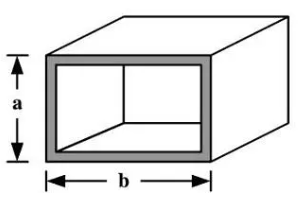

# 卡特兰数

**本页中$C_i$表示卡特兰数第$i$项，$C_n^m$表示在$n$个元素中选$m$个的组合数**

## 定义与递推公式

卡特兰数$C_i$定义为将$i$个元素依次进栈出栈的合法出栈序列数

考虑元素$1$在第$k$个出栈，则$1$前共有$k-1$个元素出栈，$1$后共有$n-k$个元素出栈

要使整个出栈序列合法，$1$前后的$k-1$，$n-k$个元素的出栈序列都要合法，则有

$$
C_i=\sum_{k=1}^iC_{k-1}\times C_{i-k}
$$

## 卡特兰数有关公式的证明及变形

将每次进栈操作记为$+1$，每次出栈操作记为$-1$，则所有的操作构成一个长为$2i$的序列

显然，序列的所有排列方式为$C_{2n}^n$

我们发现，任何时候出栈元素个数大于进栈元素个数时，这个序列一定不合法

这在序列中表现为至少有一个位置的前缀和小于$0$

如何快速求出所有不合法的排列数？

考虑一个由$n-1$个$+1$和$n+1$个$-1$构成的序列，因为$-1$个数较多，必有至少一个位置的前缀和小于$0$

我们记前缀和第一次为$-1$的位置为$i$，容易发现$i$一定为奇数

则前$i$个元素中有$\left\lfloor \frac{i}{2} \right\rfloor$个$+1$，$\left\lfloor \frac{i}{2} \right\rfloor+1$个$-1$，$-1$比$+1$多一个

那么后$2n-i$个元素中$-1$同样比$+1$多一个

我们将后$2n-i$个元素取反，就得到了一个不合法的由$n$个$+1$和$n$个$-1$组成的序列

这样的序列一共有$C_{2n}^{n+1}$或$C_{2n}^{n-1}$个

将所有可能的排列个数减去不合法的排列个数，就得到了

$$
C_n=C_{2n}^{n}-C_{2n}^{n-1}=C_{2n}^{n}-C_{2n}^{n+1}
$$

又有$\displaystyle{C_n^m=\frac{n!}{m!(n-m)!}}$，可得$\displaystyle{C_n=\frac{C_{2n}^n}{n+1}}$

再将$C_n$与$C_{n-1}$相除，可得$\displaystyle{C_n=C_{n-1}\times\frac{4n-2}{n+1}}$

我们便得到了卡特兰数的三种主要计算方法

## 卡特兰数的主要应用

+ $n$对括号的合法匹配数目
+ $n\times n$的网格图，从左下角沿网格线走到右上角,且不经过对角线下方的最短路径数
+ $n$个结点的二叉搜索树个数
+ $n+2$边形通过对角线划分成$n$个三角形的方法数

下面是一些例题

```admonish
暑假期间，小龙报名了一个模拟野外生存作战训练班来锻炼体魄。训练的第一个晚上，教官就给他们出了个难题。由于地上露营湿气重，必须选择在高处的树屋露营。小龙分配的树屋建立在一颗高度为$N + 1$尺（$N$为正整数）的大树上，正当他发愁怎么爬上去的时候，发现旁边堆满了一些空心四方钢材（如图1.1）。经过观察和测量，这些钢材截面的宽和高大小不一，但都是$1$尺的整数倍。教官命令队员们每人选取$N$个空心钢材来搭建一个总高度为$N$尺的阶梯来进入树屋，该阶梯每一步台阶的高度为$1$尺，宽度也为$1$尺。如果这些钢材有各种尺寸，且每种尺寸数量充足，那么小龙可以有多少种搭建方法？（注：为了避免夜里踏空，钢材空心的一面绝对不可以向上。）

图1.1展示了空心钢材，其中$a$和$b$均为正整数（即$1$尺的整数倍）。



以树屋高度为$4$尺、阶梯高度$N = 3$尺为例，小龙一共有如图1.2所示的$5$种搭建方法。


对于 $100\%$ 的数据，满足 $1\le N\le 500$。
```

```cpp
#include <bits/stdc++.h>
using namespace std;
int f[505][500];
int len = 1;
void mul(int u)
{
    for (int i = 1; i <= len; i++)
        f[u][i] += f[u - 1][i];
    for (int i = 1; i <= len; i++)
    {
        f[u][i + 1] += f[u][i] / 10;
        f[u][i] %= 10;
    }
    if (f[u][len + 1])
        len++;
}
int main()
{
    int n;
    cin >> n;
    f[1][1] = 1;
    for (int i = 2; i <= n + 1; i++)
        for (int j = 1; j <= i; j++)
            mul(j);
    for (int i = len; i >= 1; i--)
        cout << f[n][i];
    return 0;
}
```

```admonish
我们称一个长度为 $2n$ 的数列是有趣的，当且仅当该数列满足以下三个条件：

- 它是从 $1 \sim 2n$ 共 $2n$ 个整数的一个排列 $\{a_n\}_{n=1}^{2n}$；

- 所有的奇数项满足 $a_1<a_3< \dots < a_{2n-1}$，所有的偶数项满足 $a_2<a_4< \dots <a_{2n}$；

- 任意相邻的两项 $a_{2i-1}$ 与 $a_{2i}$ 满足：$a_{2i-1}<a_{2i}$。

对于给定的 $n$，请求出有多少个不同的长度为 $2n$ 的有趣的数列。

因为最后的答案可能很大，所以只要求输出答案对 $p$ 取模。

对于 $50\%$ 的数据，$1\le n \le 1000$；

对于 $100\%$ 的数据，$1\le n \le 10^6$，$1\le p \le 10^9$。
```

```cpp
#include <bits/stdc++.h>
using namespace std;
#define int long long
const int N = 2e6 + 5;
int mp[N], pri[N], cnt[N], mod, num, n;
int qpow(int n, int k)
{
    int ans = 1;
    while (k)
    {
        if (k & 1)
            ans = ans * n % mod;
        n = n * n % mod;
        k >>= 1;
    }
    return ans;
}
signed main()
{
    cin >> n >> mod;
    for (int i = 2; i <= 2 * n; i++)
    {
        if (!mp[i])
        {
            pri[++num] = i;
            mp[i] = i;
        }
        for (int j = 1; j <= num && i * pri[j] <= 2 * n; j++)
        {
            mp[i * pri[j]] = pri[j];
            if (i % pri[j] == 0)
                break;
        }
    }
    for (int i = 1; i <= n; i++)
        cnt[i] = -1;
    for (int i = n + 2; i <= 2 * n; i++)
        cnt[i] = 1;
    for (int i = 2 * n; i > 1; i--)
        if (mp[i] < i)
        {
            cnt[mp[i]] += cnt[i];
            cnt[i / mp[i]] += cnt[i];
        }
    int ans = 1;
    for (int i = 2; i <= 2 * n; i++)
        if (mp[i] == i)
            ans = ans * qpow(i, cnt[i]) % mod;
    cout << ans;
    return 0;
}
```
