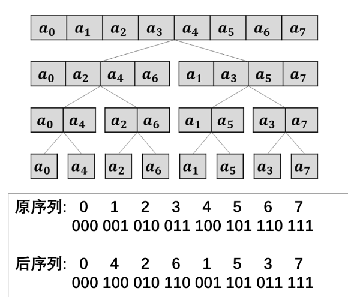

# 多项式乘法
```admonish question title="[P3803 多项式乘法](https://www.luogu.com.cn/problem/P3803)"
给定一个 $n$ 次多项式 $F(x)$，和一个 $m$ 次多项式 $G(x)$。

请求出 $F(x)$ 和 $G(x)$ 的卷积。

#### 数据范围

对于$100\%$数据：$1 \le n, m \leq {10}^6$。
```

### 快速傅里叶变换(FFT)

```admonish note title = "视频讲解（来源：董晓算法）", collapsible=true

```

朴素的多项式乘法是$O(n^2)$的，无法接受

从另一个方面出发，我们可以选取一些数$x_1,x_2,x_3,...$代入$F(x)$和$G(x)$的表达式求值，将这些点值相乘，得到$F(x) \circ G(x)$的点值表示，在利用这些点值求出其表达式

点值相乘是$O(n)$的，但是求点值表示是$O(n^2)$的，能否加速？

我们先来看一个简单的问题：
```admonish question
已知$$f(x) = 3x^5 + 4x^4 + 7x^3 + 2x^2 + 10x + 1$$求$f(1)$和$f(-1)$的值
```
容易发现，在求出$f(1)$的值后，求$f(-1)$只需要将$x^5, x^3, x$这三项符号倒过来就行

事实上，这利用了$(-1)^n,n \in \mathbf{N}$的值以$-1,1$周期出现的性质，我们发现，这大大减少了运算量

但是我们还需要更多的点

不妨将视野放大，考虑单位根的性质

```admonish note
我们记$$\omega_n^k = \cos \frac{2k\pi}{n} + i\sin \frac{2k\pi}{n} = e^{i\frac{2k\pi}{n}} \ \ \ \ \ \ n,k \in \mathbf{N}$$
对于$n = 2^t, t \in \mathbf{N}$容易发现其有如下性质：
1. (周期性) $\omega_n^k = \omega_n^{k+n}$
2. (对称性) $\omega_n^k = -\omega_n^{k+\frac{n}{2}}$
3. (折半性) $\omega_{2n}^k = -\omega_n^{\frac{k}{2}}$
4. (指数性) $\omega_n^{a + b} = \omega_n^a \omega_n^b$
```

我们考虑利用这些性质求$f(x)$的点值表示

为了利用这些性质，我们先将$n$向上扩大到$2^t, t \in \mathbf{N}$，高次项系数补$0$

我们设$$f(x) = a_0 + a_1x + a_2x^2 + a_3x^3 + a_4x^4 + a_5x^5 + ...$$

考虑将其奇偶项分组，即$$f(x) = (a_0 + a_2x^2 + a_4x^4 + ...) + (a_1x + a_3x^3 + a_5x^5 + ...)$$

令$$F_1(x) = a_0 + a_2x + a_4x^2 + ..., F_2(x) = a_1 + a_3x + a_5x^2 + ... $$

这样$$f(x) = F_1(x^2) + xF_2(x^2)$$

我们考虑对所有的$n$次单位根求点值

对于前一半$k < n$，代入$\omega_n^k$，有
$$\begin{aligned}
    f(\omega_n^k) &= F_1(\omega_n^{2k}) + \omega_n^{k}F_2(\omega_n^{2k}) \\
                  &= F_1(\omega_{\frac{n}{2}}^{k}) + \omega_n^{k}F_2(\omega_{\frac{n}{2}}^{k})
\end{aligned}$$

利用性质求另一半，代入$\omega_n^{k+\frac{n}{2}}$，有
$$\begin{aligned}
    f(\omega_n^{k+\frac{n}{2}}) &= F_1(\omega_n^{2k+n}) + \omega_n^{k+\frac{n}{2}}F_2(\omega_n^{2k+n}) \\
                                &= F_1(\omega_n^{2k}) - \omega_n^kF_2(\omega_n^{2k}) \\
                                &= F_1(\omega_{\frac{n}{2}}^k) - \omega_n^kF_2(\omega_{\frac{n}{2}}^k)
\end{aligned}$$

这时问题就转变成了求$F_1(\omega_{\frac{n}{2}}^k)$和$F_2(\omega_{\frac{n}{2}}^k)$了

容易发现，我们可以递归

现在我们已经有了点值表示，如何反过来求原多项式呢？

这一过程被称作快速傅里叶逆变换(IFFT)

设多项式$A(x)=a_0 + a_1x + a_2x^2 + \cdots + a_{n - 1}x^{n - 1}$

代入$\omega_n^0, \omega_n^1, \omega_n^2, \cdots, \omega_n^{n - 1}$得到的点值为$(y_0, y_1, y_2, \cdots, y_{n - 1})$

其中$y_i = \sum_{j = 0}^{n - 1}a_j(\omega_n^i)^j$

构造多项式$B(x)=y_0 + y_1x + y_2x^2 + \cdots + y_{n - 1}x^{n - 1}$

把$n$个单位根的倒数$\omega_n^0, \omega_n^{-1}, \omega_n^{-2}, \cdots, \omega_n^{-(n - 1)}$代入$B(x)$

得到的$n$个新点值，设为$(z_0, z_1, z_2, \cdots, z_{n - 1})$

$$
\begin{aligned}
    z_k &= \sum_{i = 0}^{n - 1}y_i(\omega_n^{-k})^i \\
        &= \sum_{i = 0}^{n - 1}\sum_{j = 0}^{n - 1}a_j(\omega_n^i)^j(\omega_n^{-k})^i \\
        &= \sum_{j = 0}^{n - 1}a_j\sum_{i = 0}^{n - 1}(\omega_n^{j - k})^i
\end{aligned}
$$

当$j = k$时，内层的和式等于$n$

当$j \neq k$时，$\frac{(\omega_n^{j - k})^n - 1}{\omega_n^{j - k} - 1}=\frac{(\omega_n^n)^{j - k} - 1}{\omega_n^{j - k} - 1}=0$

所以$z_k = na_k$，即$a_k = \frac{z_k}{n}$（单位根的神奇！）

也就是说，我们将得到的点值顺次构成的多项式再做一遍FFT，将其中的单位根取倒数，得到的序列每一项除以$n$即可

这样基于二分的思想，在单位根奇特性质的加持下，FFT就把系数与点值间的转换从$O(n^2)$优化到了$O(n\log n)$

代码实现（递归版）
```cpp
const int N = 4e6;
const double PI = acos(-1);
complex A[N], B[N];

void FFT(complex A[], int n, int op) {
    if (n == 1) return;
    complex A1[n / 2], A2[n / 2];
    for (int i = 0; i < n / 2; i++)
        A1[i] = A[i * 2], A2[i] = A[i * 2 + 1];
    FFT(A1, n / 2, op); FFT(A2, n / 2, op);
    complex w1({cos(2 * PI / n), sin(2 * PI / n) * op});
    complex wk({1, 0});
    for (int i = 0; i < n / 2; i++) {
        A[i] = A1[i] + A2[i] * wk;
        A[i + n / 2] = A1[i] - A2[i] * wk; wk = wk * w1;
    }
}

int main() {
    int n, m; scanf("%d%d", &n, &m);
    for (int i = 0; i <= n; i++) scanf("%lf", &A[i]);
    for (int i = 0; i <= m; i++) scanf("%lf", &B[i]);
    for (m = n + m, n = 1; n <= m; n <<= 1); //求n
    FFT(A, n, 1); FFT(B, n, 1); //求点值
    for (int i = 0; i < n; i++) A[i] = A[i] * B[i];//乘积
    FFT(A, n, -1); //求系数
    for (int i = 0; i <= m; i++)
        printf("%d ", (int)((A[i].real()) / n + 0.5));
}
```
但是这样太慢了，能不能将递归改成迭代？

观察其中数组元素的变化:



可以发现，每个位置的元素下标都做了二进制翻转，这个变换称为位逆序变换（也称蝴蝶变换）

先利用位逆序变换得到后序列，然后自底向上直接合并就行了，把递归版改为迭代版。

位逆序变换可以$O(n)$递推实现

设$n = 2^k$，$k$表示二进制数的长度

设$R[x]$表示长度为$k$的二进制数$x$翻转后的数

我们要求出$R[0],R[1],\cdots,R[n - 1]$，初值$R[0] = 0$

$$R[x] = \frac{R[\frac{x}{2}]}{2} + [x\&1] \times \frac{n}{2}$$

例：设$n = (100000)_2$，$k = 5$，$x = (11001)_2$
1. $x$右移一位$(01100)_2$，$R[(01100)_2]=(00110)_2$，再右移一位$(00011)_2$
2. $x$个位是$1$，所以最高位要加上$(10000)_2=\frac{n}{2}$

```cpp
void change(complex A[], int n){
    for(int i = 0; i < n; i++)
        R[i] = (R[i >> 1] >> 1) + (i & 1) * (n >> 1);
    for(int i = 0; i < n; i++)
        if(i < R[i]) swap(A[i], A[R[i]]);
}
```

于是我们可以得到最终的代码了

```cpp
#include <bits/stdc++.h>
using namespace std;
#define endl '\n'
typedef long long ll;
const int MAXN = 4e6 + 10;
const double PI = acos(-1);
struct cmpx
{
    double x, y;
    cmpx operator+(cmpx t) { return {x + t.x, y + t.y}; }
    cmpx operator-(cmpx t) { return {x - t.x, y - t.y}; }
    cmpx operator*(cmpx t) { return {x * t.x - y * t.y, x * t.y + y * t.x}; }
} A[MAXN], B[MAXN];
int R[MAXN], n, m;
void FFT(cmpx A[], int n, int op) // op = 1时，FFT；op = -1 时，IFFT
{
    // 位逆序变换
    for (int i = 0; i < n; i++)
        if (i < R[i])
            swap(A[i], A[R[i]]);
    for (int i = 2; i <= n; i <<= 1) // 枚举块的长度
    {
        cmpx w1 = {cos(2 * PI / i), sin(2 * PI / i) * op}; // 计算单位根(F2前面那个系数)
        for (int j = 0; j < n; j += i) // 枚举块的起点
        {
            cmpx wk = {1, 0}; // 从omega0开始
            for (int k = j; k < j + i / 2; k++) // 枚举每一个块内的前半部分元素
            {
                cmpx x = A[k], y = A[k + i / 2] * wk; // 计算F1, F2
                A[k] = x + y; // 求解前一半点值
                A[k + i / 2] = x - y; // 求解后一半点值
                wk = wk * w1; // 计算omegak
            }
        }
    }
}
int main()
{
    ios::sync_with_stdio(0), cin.tie(0), cout.tie(0);
    cin >> n >> m;
    for (int i = 0; i <= n; i++)
        cin >> A[i].x;
    for (int i = 0; i <= m; i++)
        cin >> B[i].x;
    for (m = n + m, n = 1; n <= m; n <<= 1); // 扩大n
    for (int i = 0; i < n; i++)
        R[i] = (R[i >> 1] >> 1) + (n >> 1) * (i & 1); // 位逆序变换预处理
    FFT(A, n, 1), FFT(B, n, 1); // 系数转点值
    for (int i = 0; i < n; i++)
        A[i] = A[i] * B[i];
    FFT(A, n, -1); // 点值相乘
    for (int i = 0; i <= m; i++)
        cout << (int)(A[i].x / n + 0.5) << ' '; // 四舍五入
    return 0;
}
```

### 快速数论变换(NTT)

```admonish note title = "视频讲解（来源：董晓算法）", collapsible=true

```

从上面的描述可以看出，FFT大量使用了复数运算，尤其是浮点数的运算，其精度不好控制

能否找到另一组数，其也具有单位根的优美性质呢？

```admonish note
#### 原根
介绍原根之前，先介绍一下阶

根据欧拉定理，如果$a \bot n$，那么有$$a^{\varphi(n)} \equiv 1 \pmod{n}$$我们知道，若$g \bot p$，对于$\forall g \in \mathbf{N}$，均$\exists n \in \mathbf{N}$，使得$g^n \equiv 1 \pmod{p}$，我们将具有上述性质的最小的$n$定义为$g$模$p$的阶，记作$\delta_p(g)$

#### 原根的定义
若$\delta_p(g)=\varphi(p)$，则称$g$为模$p$的一个原根

例$\delta_7(3)=6=\varphi(7)$，$3$是模$7$的一个原根

例$\delta_7(2)=3\neq\varphi(7)$，$2$不是模$7$的一个原根

#### 原根的性质
若$g$是模$p$的一个原根，则$g^0,g^1,g^2,\cdots,g^{\delta - 1}$在模$p$意义下两两不同，之后进入周期

例$3^0,3^1,3^2,3^3,3^4,3^5$模$7$两两不同，之后进入周期
```
因此我们貌似找到了可行的替代方案

为了多次二分，模数$p$应选形如$q\times2^k + 1$的**质数**，其中$q$为奇素数，$k$为整数

| 原根$g$ | 模数$p$      | 分解$p$             | 最大长度 |
| ------- | ------------ | ------------------- | -------- |
| $3$     | $469762049$  | $7\times2^{26}+1$   | $2^{26}$ |
| $3$     | $998244353$  | $119\times2^{23}+1$ | $2^{23}$ |
| $3$     | $2281701377$ | $17\times2^{27}+1$  | $2^{27}$ |

因$p$是质数，故$\varphi(p)=p - 1$，则$g^0,g^1,g^2,\cdots,g^{p - 1}$在模$p$下两两不同，从中选取对称的$n(n = 2^b, b \in \mathbf{N})$个值：
$g_n^0 = 1,g_n^1 = g^{\frac{p - 1}{n}},\cdots,g_n^k = g^{\frac{p - 1}{n}k},\cdots,g_n^{n - 1}$

对比$\omega_n^k(n = 2^b, b \in \mathbf{N})$的性质，我们发现$g_n^k$的如下性质：

1. (周期性) $\omega_n^k = \omega_n^{k+n}$
2. (对称性) $\omega_n^k = -\omega_n^{k+\frac{n}{2}}$
3. (折半性) $\omega_{2n}^k = -\omega_n^{\frac{k}{2}}$
4. (指数性) $\omega_n^{a + b} = \omega_n^a \omega_n^b$

我们发现，$g_n^k$真的可以代替$\omega_n^k$，并且FFT和NTT的流程几乎不变！

那IFFT和INTT也一样吗？

```admonish
注：以下计算均在模$p$意义下进行，其中的除法与倒数应当用乘法逆元理解

设多项式$A(x)=a_0 + a_1x + a_2x^2 + \cdots + a_{n - 1}x^{n - 1}$

代入$g_n^0, g_n^1, g_n^2, \cdots, g_n^{n - 1}$得到的点值为$(y_0, y_1, y_2, \cdots, y_{n - 1})$

其中$y_i = \sum_{j = 0}^{n - 1}a_j(g_n^i)^j$

构造多项式$B(x)=y_0 + y_1x + y_2x^2 + \cdots + y_{n - 1}x^{n - 1}$

把$n$个原根的倒数$g_n^0, g_n^{-1}, g_n^{-2}, \cdots, g_n^{-(n - 1)}$代入$B(x)$

得到的$n$个新点值，设为$(z_0, z_1, z_2, \cdots, z_{n - 1})$

$$
\begin{aligned}
    z_k &= \sum_{i = 0}^{n - 1}y_i(g_n^{-k})^i \\
        &= \sum_{i = 0}^{n - 1}\sum_{j = 0}^{n - 1}a_j(g_n^i)^j(g_n^{-k})^i \\
        &= \sum_{j = 0}^{n - 1}a_j\sum_{i = 0}^{n - 1}(g_n^{j - k})^i
\end{aligned}
$$

当$j = k$时，内层的和式等于$n$

当$j \neq k$时，$\frac{(g_n^{j - k})^n - 1}{g_n^{j - k} - 1}=\frac{(g_n^n)^{j - k} - 1}{g_n^{j - k} - 1}=0$

所以$z_k = na_k$，即$a_k = \frac{z_k}{n}$
```

除了四则运算都要取模，除法操作需要换成乘法逆元，其余操作真的一样！

这样我们得到NTT的代码：

```cpp
#include <bits/stdc++.h>
using namespace std;
#define endl '\n'
typedef long long ll;
const int MAXN = 4e6 + 10;
const ll p = 998244353, g = 3; // 模数和原根
ll A[MAXN], B[MAXN], gi, ni;
int R[MAXN], n, m;
ll qpow(ll a, ll b)
{
    ll res = 1;
    for (; b; b >>= 1, a = a * a % p)
        if (b & 1)
            res = res * a % p;
    return res;
}
void NTT(ll A[], int n, int op)
{
    for (int i = 0; i < n; i++) // 位逆序变换
        if (i < R[i])
            swap(A[i], A[R[i]]);
    for (int i = 2; i <= n; i <<= 1)
    {
        ll g1 = qpow(op == 1 ? g : gi, (p - 1) / i); // 对应FFT中的单位根g1
        for (int j = 0; j < n; j += i)
        {
            ll gk = 1;
            for (int k = j; k < j + i / 2; k++) // 这里的合并与FFT都是一样的
            {
                ll x = A[k], y = A[k + i / 2] * gk % p;
                A[k] = (x + y) % p;
                A[k + i / 2] = (x - y + p) % p;
                gk = gk * g1 % p; // 求解gk
            }
        }
    }
}
int main()
{
    ios::sync_with_stdio(0), cin.tie(0), cout.tie(0);
    cin >> n >> m;
    for (int i = 0; i <= n; i++)
        cin >> A[i];
    for (int i = 0; i <= m; i++)
        cin >> B[i];
    for (m = n + m, n = 1; n <= m; n <<= 1);
    gi = qpow(g, p - 2), ni = qpow(n, p - 2); // 求g和n的乘法逆元，这里gi也可以提前解出
    for (int i = 0; i < n; i++)
        R[i] = (R[i >> 1] >> 1) + (n >> 1) * (i & 1);
    NTT(A, n, 1), NTT(B, n, 1);
    for (int i = 0; i < n; i++)
        A[i] = A[i] * B[i] % p;
    NTT(A, n, -1);
    for (int i = 0; i <= m; i++)
        cout << A[i] * ni % p << ' ';
    return 0;
}
```

从中也能看出NTT的限制:

- 所求的多项式要求是整系数。
- 如果题目要求结果对质数$p$取模，这个质数往往只能是$998244353$，否则会有很多麻烦，这个会在后面谈到。
- 所求多项式的项数应在$2^{23}$之内，因为$998244353 = 7\times17\times2^{23}+1$。
- 结果的系数不应超过质数$P$。（$P$是自己选择的质数，一般定为$P = 998244353$）