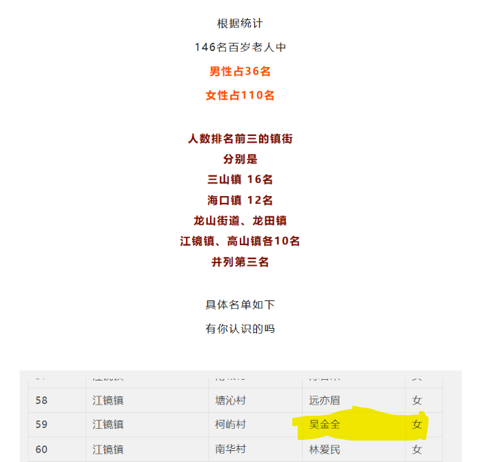

# 吴金全的自我介绍

---

吴金全老师是武汉武钢三中的资深信息学竞赛教练，长期致力于培养学生在计算机算法与编程领域的竞赛能力，其教学成果显著，为学校在信息学奥林匹克竞赛中保持湖北省领先地位作出了重要贡献。以下是关于他的详细介绍：

---

## 一、教育成就与教学特色
#### 竞赛成绩
吴金全指导的学生多次在全国性信息学竞赛中斩获佳绩。例如：

李文超（2019届）：高中零基础起步，通过三年高强度训练，在第36届全国信息学奥赛中获得银牌，签约上海交通大学一本线录取优惠。

向路加：同届比赛中获铜牌，并获中国人民大学降60分录取资格。

黄钰（2022届）：在第39届全国信息学奥赛冬令营中获金牌（湖北省仅两人），其高效的学习方法和规律的作息成为典型案例。

#### 教学理念
吴老师强调信息学竞赛与数学的紧密关联，注重学生逻辑思维、数学功底与综合素质的结合。他认为适合竞赛的学生需具备以下特质：

细心：编程要求零容错，细微错误可能导致调试时间远超编码时间。

专注与计划性：学生需制定科学的学习计划并严格执行，例如李文超三年提交3600余次测评、参加110余场模拟赛，黄钰坚持规律作息与自主学习。

全面发展：竞赛涉及大量新知识，需学生具备扎实的文化课基础和自主学习能力。

---

## 二、教学方法与培养模式
#### 高强度训练体系
吴金全设计了一套系统的训练方案，包括：

国际竞赛实战：鼓励学生参与俄罗斯CodeForces等国际线上比赛，适应不同题型与时差挑战。

校内模拟赛与测评：通过高频次的校内模拟赛（如李文超3年参与110余场）和在线评测平台（如LG网站）积累实战经验。

#### 个性化指导与团队协作

采用“小助教”模式，让优秀学生（如黄钰）辅导低年级学生，既巩固自身知识，又提升团队整体水平。

注重学生兴趣与特长的结合，例如指导黄钰与石城玮将音乐爱好融入学习生活，缓解竞赛压力。

---

## 三、行业影响与荣誉
#### 湖北省信息学竞赛领军人物
武钢三中信息学竞赛自20世纪90年代初起步，在吴金全等教师的推动下，长期保持省内龙头地位，并向清华、北大等名校输送了大批人才。

#### 教师荣誉
多次获评中国计算机学会优秀教师、湖北省信息学优秀辅导教师，其教学案例被多家媒体报道。

---

## 四、教育理念的延伸意义
吴金全认为，信息学竞赛不仅是学科能力的比拼，更是对未来科技趋势的认知（如AI与互联网），能全面提升学生的综合素养与创新思维。他的成功经验为普通学生通过努力实现逆袭提供了范例，例如李文超从零基础到银牌的成长路径，激励了许多对编程感兴趣的学生。

